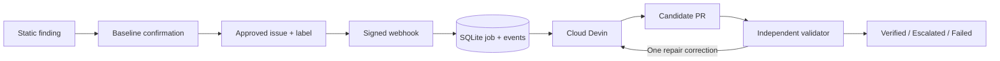

# Devin Remediation Platform

Turn a confirmed weak test or application defect into a candidate PR, then independently verify the exact repair contract before human review.

## What it does

An approved GitHub issue receives `devin-remediate`. A signed webhook persists a job. One worker launches Cloud Devin with a reusable playbook, knowledge note, and baseline evidence attachment. When a PR appears, an external pytest harness checks the exact commit. A genuine repair failure gets one correction in the same session; infrastructure errors do not.



FastAPI, synchronous httpx, SQLite, one worker, and one server-rendered template. No external queue and no auto-merge.

## Run the simulation

Python 3.12 or 3.13 on Linux/macOS:

```bash
python3 -m venv .venv
. .venv/bin/activate
pip install -c constraints.txt -e '.[dev]'
make demo
```

Open `http://127.0.0.1:8000` for the product overview, or `http://127.0.0.1:8000/dashboard` for the workbench. No `.env`, credentials, GitHub writes, or Devin calls are needed. `make demo` resets **only** `data/simulation`, signs real webhook requests, and exercises the real persistence/orchestration code with fake external adapters. It covers first-pass verification, correction recovery, application acceptance and rejection, escalation, duplicate delivery, and worker restart with a saved session.

The `SIMULATION` badge is permanent. Synthetic outcomes and local execution times are not live remediation evidence. To run without starting the server:

The current deterministic run produces **6 jobs, 4 `VERIFIED`, 2 `ESCALATED`, 6 sessions, and 3 correction messages**. These are local simulation counts from persisted records, not customer success rates or live Devin results.

```bash
python -m app.cli demo --reset
make test
make lint
```

## DevinTrace: the evidence workbench

The workbench at `/dashboard` and the download at `/report.json` are two views of the same read-only report model in `app/report.py`. The report includes the execution mode, an explicit simulation truth statement, KPI denominators, the event-to-oracle workflow, registered case contracts, readiness gates, persisted job status, exact candidate and validated SHAs, validation outcomes, and event timelines. A report link is not treated as proof of a merge or a live repair.

The public overview at `/` links to a separately dated archive at `/evidence`; archived success is never added to workspace metrics. `/cases` exposes contract scope and readiness, and `/jobs/{id}` puts the verdict, exact-SHA proof comparison, and event trail first. Search, workflow/state filters, ordering, and 20-row pagination use normal GET requests. The browser cannot enqueue work.

The portfolio labels synthetic records as `SIMULATED`, candidate artifacts as observed, and a live job as independently verified only when the persisted status is `VERIFIED` and a validated SHA exists in the underlying report. The UI additionally warns when the candidate and validated SHA do not match; it does not endorse an unlinked verified state. The simulation dashboard therefore demonstrates orchestration and recovery while keeping customer-facing language honest. `/report.json` is suitable for attaching the same evidence snapshot to a review without scraping HTML.

The top of `/dashboard` is a leader strip that answers "is this working?": verified fixes out of terminal runs, median label-to-verified time, first-pass rate, provider-reported ACUs per verified fix (shown as "Not reported" when the provider returns none), human touches per fix, and jobs needing attention. A per-job throughput list sits beside it.

Engineers do not need the dashboard to follow a run. The worker keeps one **DevinTrace status** comment on the triggering issue and edits it in place as the job moves through its states. It links the Devin session, the PR at its exact commit, the validator verdict, and the correction count. A failed comment write is recorded as an event and never changes the job's status. `python -m app.cli issue-status --job-id <id>` re-syncs a card by hand.

For the five-minute What/How/Why/When walkthrough, use [`docs/demo-script.md`](docs/demo-script.md). For exact routes, payloads, state transitions, and adapter calls, see [`docs/app-walkthrough.md`](docs/app-walkthrough.md).

## Why Devin

- **No per-bug code.** Each bug needs someone to read the code, reproduce it, choose the fix, and write the test. A script, codemod, or linter cannot; Devin does it from a brief.
- **Autonomous, API-driven.** A copilot needs an engineer driving each step. Here a GitHub event starts a Devin session through the API and a PR comes back with no one watching; the app only polls, reconciles, and sends at most one correction.
- **Parallel and observable.** Each session has its own machine and opens its own PR, so sessions can run side by side. Every run links its Devin session so reviewers can watch the work.
- **Safe to hand over.** The independent oracle, not Devin's own "done", decides the outcome.

A syntax rule can identify assertions that only run inside `except`, but it does not establish intended behavior. A repair still needs to understand fixtures, distinguish numeric strings from invalid input, preserve valid behavior, and make a scoped repository change. Devin handles that investigation. The external evaluator, not Devin's completion status or PR description, decides whether the candidate meets the contract.

## Evaluation

| Run | Original test, required baseline | Repaired test, required acceptance |
| --- | --- | --- |
| Correct behavior | PASS | PASS |
| Same active controlled regression | PASS: regression escaped | Assertion fails: regression detected |

Each phase uses a fresh detached worktree. An autouse external fixture first proves the intended behavior or mutation is active. Import provenance must point into that worktree, not an installed copy of Superset. Exact test IDs must be collected and complete setup, call, and teardown. Skips, xfails, missing tests, non-assertion exceptions, timeouts, and inactive controls cannot produce `VERIFIED`.

Before running candidate Python, validation requires a descendant of the pinned baseline, changes only within the registered scope, regular non-executable files, no additions/deletions/renames, and at most 200 changed lines. Test-quality cases allow their registered test file; application cases allow their approved production path and use a trusted acceptance oracle outside the candidate checkout. The validator records the evaluated SHA and re-reads the PR head before accepting it. A moving head is rechecked at most three times.

### Registered cases and live results

Test-quality cases and `report-anchor-non-string` are pinned to Superset `5ecb19cf92ae8dedbf5b33ec92324cc77c4ee10e` on `remediation-demo`. `import-unparseable-yaml` is pinned to `dedfe23a805151decca6deaf15b032e040e42e82` on `remediation-import-yaml`. `make baseline` confirmed all five before any paid run.

| Case | Kind | Baseline defect | Issue -> PR | Live result |
| --- | --- | --- | --- | --- |
| `histogram-invalid-column` | Test quality | Test asserts only inside `except`; a regression that makes invalid values numeric passes it. `"10"` must stay valid. | [#5](https://github.com/dheeraj5612/superset/issues/5) -> [#12](https://github.com/dheeraj5612/superset/pull/12) | `VERIFIED`, first pass |
| `schema-missing-engine` | Test quality | Test asserts only inside `except`; a regression that accepts parameters without an engine passes it. | [#2](https://github.com/dheeraj5612/superset/issues/2) -> [#11](https://github.com/dheeraj5612/superset/pull/11) | `VERIFIED`, first pass |
| `superset-normalize-dttm-edge-cases` | Test quality | Edge-case test never checks its result; a regression that skips one-row conversion passes it. | [#9](https://github.com/dheeraj5612/superset/issues/9) -> [#10](https://github.com/dheeraj5612/superset/pull/10) | `VERIFIED`, first pass after an `INFRA_ERROR` re-validation |
| `report-anchor-non-string` | Application | A list, dict, or number in `extra.dashboard.anchor` raises `TypeError` (HTTP 500) instead of a validation error. | [#13](https://github.com/dheeraj5612/superset/issues/13) -> [#14](https://github.com/dheeraj5612/superset/pull/14) | `VERIFIED`, first pass |
| `import-unparseable-yaml` | Application | Malformed YAML raises `UnboundLocalError` while building its diagnostic. | [#7](https://github.com/dheeraj5612/superset/issues/7) -> [#8](https://github.com/dheeraj5612/superset/pull/8) | `VERIFIED` in an earlier live run, merged; [archived evidence](evidence/live-application.json) |

Test-quality verification requires the original behavior to `PASS` and the registered regression to fail by assertion. Application verification requires the trusted oracle to report `PASS` after its controls; the baseline must reproduce `REGRESSION`, and a fix that handles only some inputs is `CONTRACT_FAILED`. An import, collection, or activation failure is `INFRA_ERROR`, never a verdict.

Case contracts, paths, baseline SHAs, and test IDs live in `evals/cases.yaml`. Executable commands are constructed by the validator from this trusted registry, never from an issue body. Evidence is pinned to the case and evaluator fingerprints; changing either requires baseline confirmation again.

## Run live

Do this in a **dedicated disposable environment**. Candidate test code is executable Python; a worktree and a scrubbed environment are not a security sandbox.

1. Prepare a public Superset fork and the registered case branches at their pinned SHAs. The test-quality cases use `remediation-demo`; the application case uses its case-specific target branch. Connect that fork to the intended Devin organization. Prepare Superset's actual dependencies and pytest environment from the pinned repository's contributor instructions. Do not substitute mocks for missing dependencies.
2. Copy `.env.example` to `.env`. Set `SUPERSET_REPO_PATH`, `SUPERSET_PYTHON`, and optionally `SUPERSET_CONFIG_PATH` to the prepared environment. Set `ALLOW_LOCAL_VALIDATION=true`. Run `make baseline`. Every registered case must be confirmed; inspect the evidence under `data/live/baselines/`.
3. Set `DEVIN_API_KEY`, `DEVIN_ORG_ID`, and `DEVIN_MAX_ACU`. Use a credential accepted by the organization's v3 API, with session and context-resource permissions. Set `GITHUB_REPOSITORY` to the **Superset fork**, its numeric `GITHUB_REPOSITORY_ID`, a read-capable `GITHUB_TOKEN`, and a random `GITHUB_WEBHOOK_SECRET`.
4. Run `make bootstrap-context`. This explicitly creates or reuses the organization playbook and knowledge note, but does not create a session. Existing resources with the same name but different content are rejected for manual review.
5. Create one issue per confirmed case in the fork, including its contract and baseline evidence. Bind the actual issue numbers in `.env`, for example `CASE_ISSUES={"histogram-invalid-column":123,"schema-missing-engine":124,"import-unparseable-yaml":125}`. Keep them unlabeled for now.
6. Set `ENABLE_LIVE=true`; run `make doctor`. Start the web process and worker in separate terminals. Configure an `issues` webhook with JSON, the shared secret, and the public HTTPS URL ending in `/webhooks/github`. Expose only the webhook path; keep the unauthenticated dashboard private.
7. Add `devin-remediate` to one approved issue. **This can start paid work.** Inspect the session, exact PR SHA, evaluation evidence, and event timeline before triggering another case. Cloud Devin must author the Superset repairs; this repository does not contain pre-written demonstration fixes.

```bash
uvicorn app.main:create_app --factory --host 127.0.0.1 --port 8000
# Separate terminal, same environment and working directory:
python worker.py
```

If a candidate stops with `INFRA_ERROR`, fix the evaluator setup and rebuild all
baselines. Stop the worker, then retry the saved PR without creating another
Devin session:

```bash
python -m app.cli revalidate --job-id <existing-job-id>
```

This operator command requires the same approved issue, unchanged open PR head,
current baseline proof, and an available worker lock. It records `VERIFIED` only
when the independent checks pass at the saved SHA.

`.env` is ignored by Git and excluded from the Docker image. `DEVIN_MAX_ACU` defaults to 3 per session, and the application never creates a fresh session for a correction. No API secret is sent in the candidate subprocess environment or included in event logs.

## Docker

```bash
cp .env.example .env
docker compose up --build
```

This starts the web service in disabled-live mode on `127.0.0.1:8000` and persists SQLite in a named volume. It does not start paid execution. If port 8000 is taken, set `WEB_PORT`, for example `WEB_PORT=8020 docker compose up --build`. To load the credential-free simulation into the same volume:

```bash
docker compose run --rm web python -m app.cli demo --reset
```

Verified on 23 September 2026 with Docker Engine 29.5.2 and Compose 5.5.1 from a clean copy without `.env` credentials: the image built, `/` returned 200, `/healthz` reported live disabled, and the in-container demo completed.

### Full live stack in containers

`docker-compose.live.yml` runs both web and worker from the `live` image target. That image adds a Linux Python 3.11 evaluator environment at `/opt/superset-venv` (pinned in `docker/superset-evaluator-requirements.txt`), built in its own stage so app edits never rebuild it. The Superset fork checkout is mounted at `/superset` and `./data` at `/data`, so host and container share one set of live jobs, baselines, and Devin context.

```bash
# .env from .env.example with credentials filled in, plus MODE=LIVE and ENABLE_LIVE=true
SUPERSET_REPO_PATH=/path/to/superset-fork \
  docker compose -f docker-compose.yml -f docker-compose.live.yml --profile live up -d --build
docker compose -f docker-compose.yml -f docker-compose.live.yml exec worker python -m app.cli doctor
```

The dashboard binds to `127.0.0.1:${WEB_PORT:-8010}` only; it has no login, so keep it local. The plain `docker compose --profile live up` (no override file) expects a Linux interpreter inside the mounted checkout at `/superset/.venv/bin/python` and a named `/data` volume; a macOS virtual environment cannot be reused inside the Linux container.

Verified on 24 September 2026 (Colima, Compose override above): web healthy on `127.0.0.1:8010` reporting `LIVE`, all pages 200, all seven readiness gates Pass inside the container, and `app.cli doctor` in the worker returned `ready: true` against the four persisted live jobs.

## Devin API usage

The client uses `https://api.devin.ai/v3/organizations/{org_id}`:

| Primitive | Implemented operations |
| --- | --- |
| Sessions | Create, get, cursor-paginated list, reconcile by job tag, send one correction message |
| Playbooks | List and create/reuse repo-scoped, repository-and-body-hashed `superset-remediation-<repo-slug>-<repo-hash10>-<body-hash10>-v2` resources |
| Knowledge notes | List and create/reuse the same repo-scoped, repository-and-body-hashed resources through `/knowledge/notes`; content drift is rejected |
| Attachments | Upload a compact case and baseline-proof JSON file; pass its returned URL into the session |

Session creation supplies documented `repos`, `playbook_id`, `knowledge_ids`, `attachment_urls`, `tags`, `max_acu_limit`, and structured-output fields. PR URLs are discovered from provider metadata and independently rechecked with GitHub. Provider metadata never substitutes for evaluation.

Reference: [API overview](https://docs.devin.ai/api-reference/overview), [create session](https://docs.devin.ai/api-reference/v3/sessions/post-organizations-sessions), [playbooks](https://docs.devin.ai/api-reference/v3/playbooks/organizations-playbooks), [knowledge notes](https://docs.devin.ai/api-reference/v3/notes/organizations-knowledge-notes), [attachments](https://docs.devin.ai/api-reference/v3/attachments/post-organizations-attachments).

## Reliability and observability

The webhook validates the original bytes with constant-time HMAC comparison, exact repository ID/name, exact label, and approved issue binding. SQLite serializes delivery and logical-job deduplication in short transactions. One worker holds an OS lock for the database; network and evaluator calls run outside database transactions.

A durable launch intent is written **before** the paid request. If a response is lost, the worker searches for that job's tag. If it cannot establish the existing session, it escalates instead of blindly repeating the POST. A lost correction acknowledgement also requires manual review. This prioritizes avoiding duplicate spend over automatic recovery; it is not an exactly-once provider guarantee. Read failures have bounded retries. The job deadline stops polling, not the remote session: inspect/terminate it in Devin when a deadline is reached; the provider ACU cap remains the spending bound.

The dashboard and `/metrics` JSON are calculated from persisted records: attempts, active/verified/unsuccessful jobs, first-pass count and evaluated-job denominator, correction recovery count and acknowledged-correction denominator, median event-to-observed-PR and event-to-verification latency, and suppressed deliveries. Infrastructure-only evaluations do not enter the first-pass denominator. Timelines include provider state, launch intent, correction intent, evaluation outcome, and exact SHA. Live and simulation use separate databases and separate metrics.

## Results and verification

Live batch, 23 September 2026, on `dheeraj5612/superset`: four labelled issues, four Devin sessions, four candidate PRs, four `VERIFIED` at an exact matching SHA, zero correction messages. Median label-to-verified time is shown on the dashboard. Every job's timeline, API operations, and verdict are exported at `/report.json`. The provider reported `0.0` consumed ACUs for these sessions; that is labelled provider-reported and no cost or savings figure is derived from it.

Earlier evidence is kept separate: [`evidence/application-oracle.json`](evidence/application-oracle.json) is the local source comparator for the YAML case, and [`evidence/live-application.json`](evidence/live-application.json) is its earlier live run (PR #8, since merged). The credential-free simulation has its own database and never enters live metrics.

The control-plane suite passes under Python 3.14.7 with Ruff clean; GitHub Verify runs it under Python 3.12. Each oracle proves its registered contract, not the full Superset suite.

## Why Devin, not something else

| Option | Good at | Why it falls short here |
|---|---|---|
| Rule bots, codemods | Known mechanical patterns | Cannot read intent, reproduce a bug, or write a new test |
| IDE copilot | Suggestions while an engineer types | An engineer drives each step; no event trigger |
| Raw LLM API call | A patch from text | No repo, shell, or tests; we would build the agent loop, sandbox, git, and PR flow |
| **Devin** | Own machine: clone, reproduce, fix, test, push, open PR | Fits: Sessions (budget caps, tags, messages), Playbooks, Knowledge, and Attachments are the harness we would otherwise build |

## Key architectural decisions

1. **Allow-list, not free text.** Only issues bound to `evals/cases.yaml` start work; HMAC-verified webhook; unapproved issues get 422. `app/main.py`, `app/cases.py`
2. **Durable job before any paid call.** SQLite row written under `BEGIN IMMEDIATE`; GitHub redeliveries reuse the job. Guarded state machine. `app/db.py`, `app/models.py`
3. **Crash-safe sessions.** Sessions tagged `drp-<job id>`; lost create replies are recovered by listing by tag. `max_acu_limit` per session; at most one correction message in the same session. `app/devin.py`, `app/orchestrator.py`
4. **Team rules as versioned config.** Playbook and Knowledge created once per repo, named by content hash, so a changed copy is never silently reused. `app/devin.py`
5. **Separate trust plane.** Validator fetches the PR head, detached worktree at the exact SHA, modify-only scope check against `allowed_paths`, scrubbed env, control-plane oracle. Only it can say `VERIFIED`; `INFRA_ERROR` is never a pass. `app/validator.py`
6. **Evidence-first observability.** Every step is an event; metrics, dashboard, and `/report.json` derive from the log. Status comment edited in place via hidden marker. `app/report.py`, `app/metrics.py`, `app/issue_status.py`
7. **Credential-free simulation** with fake providers, never mixed into live metrics. `app/simulation.py`

## Next steps in a customer engagement

1. Week 1: connect the customer's scanner (e.g. Snyk, CodeQL) or Jira feed as the trigger alongside the GitHub label.
2. Pilot: 10 to 20 approved cases with success targets agreed with the team: proven-fix rate, label-to-proof time, reviewer minutes per PR.
3. Scale: grow the case library (one YAML entry + one oracle each), run sessions in parallel on isolated runners, add auth and a real queue, and report provider-reported ACUs per proven fix.

## Limitations

- Targeted take-home, not a general mutation-testing service: five registered contracts, not the full Superset suite. Human review still checks the complete diff.
- Candidate code is executable Python. Worktrees, scope checks, and environment scrubbing reduce mistakes; they are not a sandbox against hostile code or prompt injection. Production would start with isolated credential-free runners.
- The dashboard is unauthenticated; keep it on localhost and expose only the webhook path.
- SQLite with one worker. Bootstrap and infrastructure re-validation are operator commands; terminal jobs have no automatic retry.
- The earlier `src/drp` prototype was consolidated into `app/`; its datetime finding is preserved under `findings/` as prior research only.

## Five-minute walkthrough

[`docs/demo-script.md`](docs/demo-script.md) is the Loom script in What/How/Why/When order, with a pre-recording checklist. It follows issue #13 from label to status comment, PR, and independent verdict, then the leader strip.

### Design and browser review

[`DESIGN.md`](DESIGN.md) records the selected system, three concept directions, evidence semantics, and interaction rules. [`docs/design/concepts.html`](docs/design/concepts.html) contains the composition studies. The two refinement cycles and validation scope are recorded in [`docs/design/CRITIQUE.md`](docs/design/CRITIQUE.md).

The interface adds no JavaScript framework, remote fonts, or runtime Node dependencies. CSS, progressive JavaScript, the original SVG wordmark, and favicon assets are served locally under a strict Content Security Policy. No-JavaScript filtering and deep links remain functional. Operational routes are `noindex` and uncached, **not authenticated**; keep them private as described above.

Optional real-browser review (Chromium, isolated synthetic fixtures, no paid calls):

```sh
python -m pip install -r requirements-ui.txt
python -m playwright install --with-deps chromium
npm install --no-save --prefix /tmp/proofline-a11y axe-core@4.10.3
python scripts/ui_review.py --axe /tmp/proofline-a11y/node_modules/axe-core/axe.min.js --output /tmp/proofline-ui-review
```

The `Product UI review` workflow runs the same checks and uploads desktop/mobile screenshots, the actual downloaded report, and a machine-readable validation log. It also checks the pinned pre-redesign checkout for before screenshots. Test tools are optional and are not added to the production Docker image.
