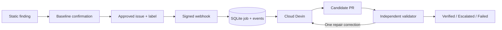

# Devin Remediation Platform

Turn a confirmed weak test into a candidate PR, then independently verify that the repaired test detects the regression it previously missed.

## What it does

An approved GitHub issue receives `devin-remediate`. A signed webhook persists a job. One worker launches Cloud Devin with a reusable playbook, knowledge note, and baseline evidence attachment. When a PR appears, an external pytest harness checks the exact commit. A genuine repair failure gets one correction in the same session; infrastructure errors do not.



FastAPI, synchronous httpx, SQLite, one worker, and one server-rendered template. No external queue and no auto-merge.

## Run the simulation

Python 3.12 or 3.13 on Linux/macOS:

```bash
python3 -m venv .venv
. .venv/bin/activate
pip install -c constraints.txt -e '.[dev]'
make demo
```

Open `http://127.0.0.1:8000` for the product overview, or `http://127.0.0.1:8000/dashboard` for the workbench. No `.env`, credentials, GitHub writes, or Devin calls are needed. `make demo` resets **only** `data/simulation`, signs real webhook requests, and exercises the real persistence/orchestration code with fake external adapters. It covers first-pass verification, correction recovery, application acceptance and rejection, escalation, duplicate delivery, and worker restart with a saved session.

The `SIMULATION` badge is permanent. Synthetic outcomes and local execution times are not live remediation evidence. To run without starting the server:

The current deterministic run produces **6 jobs, 4 `VERIFIED`, 2 `ESCALATED`, 6 sessions, and 3 correction messages**. These are local simulation counts from persisted records, not customer success rates or live Devin results.

```bash
python -m app.cli demo --reset
make test
make lint
```

## Proofline: the evidence workbench

The workbench at `/dashboard` and the download at `/report.json` are two views of the same read-only report model in `app/report.py`. The report includes the execution mode, an explicit simulation truth statement, KPI denominators, the event-to-oracle workflow, registered case contracts, readiness gates, persisted job status, exact candidate and validated SHAs, validation outcomes, and event timelines. A report link is not treated as proof of a merge or a live repair.

The public overview at `/` links to a separately dated archive at `/evidence`; archived success is never added to workspace metrics. `/cases` exposes contract scope and readiness, and `/jobs/{id}` puts the verdict, exact-SHA proof comparison, and event trail first. Search, workflow/state filters, ordering, and 20-row pagination use normal GET requests. The browser cannot enqueue work.

The portfolio labels synthetic records as `SIMULATED`, candidate artifacts as observed, and a live job as independently verified only when the persisted status is `VERIFIED` and a validated SHA exists in the underlying report. The UI additionally warns when the candidate and validated SHA do not match; it does not endorse an unlinked verified state. The simulation dashboard therefore demonstrates orchestration and recovery while keeping customer-facing language honest. `/report.json` is suitable for attaching the same evidence snapshot to a review without scraping HTML.

For a five-minute customer walkthrough, use [`docs/demo-script.md`](docs/demo-script.md). It covers what problem the platform solves, how the signed event and independent oracle fit together, why Devin is used for investigation, and the gates for a one-finding pilot. The script distinguishes deterministic simulation evidence from fields available only after a configured live run.

## Why Devin

A syntax rule can identify assertions that only run inside `except`, but it does not establish intended behavior. A repair still needs to understand fixtures, distinguish numeric strings from invalid input, preserve valid behavior, and make a scoped repository change. Devin handles that investigation. The external evaluator, not Devin's completion status or PR description, decides whether the candidate meets the contract.

## Evaluation

| Run | Original test, required baseline | Repaired test, required acceptance |
| --- | --- | --- |
| Correct behavior | PASS | PASS |
| Same active controlled regression | PASS: regression escaped | Assertion fails: regression detected |

Each phase uses a fresh detached worktree. An autouse external fixture first proves the intended behavior or mutation is active. Import provenance must point into that worktree, not an installed copy of Superset. Exact test IDs must be collected and complete setup, call, and teardown. Skips, xfails, missing tests, non-assertion exceptions, timeouts, and inactive controls cannot produce `VERIFIED`.

Before running candidate Python, validation requires a descendant of the pinned baseline, changes only within the registered scope, regular non-executable files, no additions/deletions/renames, and at most 200 changed lines. Test-quality cases allow their registered test file; application cases allow their approved production path and use a trusted acceptance oracle outside the candidate checkout. The validator records the evaluated SHA and re-reads the PR head before accepting it. A moving head is rechecked at most three times.

### Registered cases and evaluation modes

Pinned upstream: `5ecb19cf92ae8dedbf5b33ec92324cc77c4ee10e`.

The application case is pinned separately to `dedfe23a805151decca6deaf15b032e040e42e82` and targets the registered `remediation-import-yaml` branch.

| Case | Source inspection | Runtime admission |
| --- | --- | --- |
| `histogram-invalid-column` | `test_histogram_with_non_numeric_column` asserts only inside `except`. The challenge makes invalid values numeric without raising. Numeric strings such as `"10"` must remain valid. | **Unconfirmed** |
| `schema-missing-engine` | `test_database_parameters_schema_mixin_no_engine` asserts only inside `except`. The challenge accepts dynamic-form parameters without an engine. | **Unconfirmed** |
| `import-unparseable-yaml` | Application oracle exercises valid YAML and malformed YAML against the candidate production module. The baseline defect raises `UnboundLocalError` while constructing the malformed-file diagnostic. | **Confirmed live** ([live evidence](evidence/live-application.json)) |

The two test-quality rows are source-inspected hypotheses, not measured successes. The application row has both a local pinned-source comparator result and one fresh live Devin candidate result. The baseline reproduced the expected regression, the known fixed reference passed locally, and candidate PR #8 passed the independent application oracle with provenance. The live result does not claim a merge, customer impact, ACU cost or savings, or a full Superset suite run. Its evidence labels a provider-reported terminal snapshot of 0.0 ACUs without independent cost verification. The full Superset test-quality environment was unavailable during this build. `make baseline` must produce normal PASS, mutant PASS, and active positive controls for test-quality cases, or a controlled `REGRESSION` result with candidate provenance for the application case, before a case can enter the live queue. A failure to import, collect, or activate is an infrastructure error, not proof of a blind spot. The numeric-string example is not treated as invalid input, and schema tests whose fixture returns a valid dummy engine are not assumed to test an invalid engine.

Case contracts, paths, baseline SHAs, and test IDs live in `evals/cases.yaml`. Executable commands are constructed by the validator from this trusted registry, never from an issue body. Evidence is pinned to the case and evaluator fingerprints; changing either requires baseline confirmation again.

## Run live

Do this in a **dedicated disposable environment**. Candidate test code is executable Python; a worktree and a scrubbed environment are not a security sandbox.

1. Prepare a public Superset fork and the registered case branches at their pinned SHAs. The test-quality cases use `remediation-demo`; the application case uses its case-specific target branch. Connect that fork to the intended Devin organization. Prepare Superset's actual dependencies and pytest environment from the pinned repository's contributor instructions. Do not substitute mocks for missing dependencies.
2. Copy `.env.example` to `.env`. Set `SUPERSET_REPO_PATH`, `SUPERSET_PYTHON`, and optionally `SUPERSET_CONFIG_PATH` to the prepared environment. Set `ALLOW_LOCAL_VALIDATION=true`. Run `make baseline`. Every registered case must be confirmed; inspect the evidence under `data/live/baselines/`.
3. Set `DEVIN_API_KEY`, `DEVIN_ORG_ID`, and `DEVIN_MAX_ACU`. Use a credential accepted by the organization's v3 API, with session and context-resource permissions. Set `GITHUB_REPOSITORY` to the **Superset fork**, its numeric `GITHUB_REPOSITORY_ID`, a read-capable `GITHUB_TOKEN`, and a random `GITHUB_WEBHOOK_SECRET`.
4. Run `make bootstrap-context`. This explicitly creates or reuses the organization playbook and knowledge note, but does not create a session. Existing resources with the same name but different content are rejected for manual review.
5. Create one issue per confirmed case in the fork, including its contract and baseline evidence. Bind the actual issue numbers in `.env`, for example `CASE_ISSUES={"histogram-invalid-column":123,"schema-missing-engine":124}`. Keep them unlabeled for now.
6. Set `ENABLE_LIVE=true`; run `make doctor`. Start the web process and worker in separate terminals. Configure an `issues` webhook with JSON, the shared secret, and the public HTTPS URL ending in `/webhooks/github`. Expose only the webhook path; keep the unauthenticated dashboard private.
7. Add `devin-remediate` to one approved issue. **This can start paid work.** Inspect the session, exact PR SHA, evaluation evidence, and event timeline before triggering another case. Cloud Devin must author the Superset repairs; this repository does not contain pre-written demonstration fixes.

```bash
uvicorn app.main:create_app --factory --host 127.0.0.1 --port 8000
# Separate terminal, same environment and working directory:
python worker.py
```

`.env` is ignored by Git and excluded from the Docker image. `DEVIN_MAX_ACU` defaults to 3 per session, and the application never creates a fresh session for a correction. No API secret is sent in the candidate subprocess environment or included in event logs.

## Docker

```bash
cp .env.example .env
docker compose up --build
```

This starts the web service in disabled-live mode and persists SQLite in a named volume. It does not start paid execution. Local `make demo` is the shortest credential-free review path.

The optional `live` Compose profile includes the worker:

```bash
docker compose --profile live up --build
```

For that profile, the mounted Superset checkout needs a **Linux-compatible** prepared interpreter at `/superset/.venv/bin/python`. A macOS virtual environment cannot be reused inside the Linux container. Baseline evidence and context must be prepared in the same named `/data` volume, for example with `docker compose run --rm worker python -m app.cli baseline` and then `bootstrap-context`. Do not mix host-local and container data directories. No full Superset environment is bundled into the web image.

## Devin API usage

The client uses `https://api.devin.ai/v3/organizations/{org_id}`:

| Primitive | Implemented operations |
| --- | --- |
| Sessions | Create, get, cursor-paginated list, reconcile by job tag, send one correction message |
| Playbooks | List and create/reuse repo-scoped, body-hashed `superset-remediation-<repo-slug>-<body-hash10>-v2` resources |
| Knowledge notes | List and create/reuse the same repo-scoped, body-hashed resources through `/knowledge/notes`; content drift is rejected |
| Attachments | Upload a compact case and baseline-proof JSON file; pass its returned URL into the session |

Session creation supplies documented `repos`, `playbook_id`, `knowledge_ids`, `attachment_urls`, `tags`, `max_acu_limit`, and structured-output fields. PR URLs are discovered from provider metadata and independently rechecked with GitHub. Provider metadata never substitutes for evaluation.

Reference: [API overview](https://docs.devin.ai/api-reference/overview), [create session](https://docs.devin.ai/api-reference/v3/sessions/post-organizations-sessions), [playbooks](https://docs.devin.ai/api-reference/v3/playbooks/organizations-playbooks), [knowledge notes](https://docs.devin.ai/api-reference/v3/notes/organizations-knowledge-notes), [attachments](https://docs.devin.ai/api-reference/v3/attachments/post-organizations-attachments).

## Reliability and observability

The webhook validates the original bytes with constant-time HMAC comparison, exact repository ID/name, exact label, and approved issue binding. SQLite serializes delivery and logical-job deduplication in short transactions. One worker holds an OS lock for the database; network and evaluator calls run outside database transactions.

A durable launch intent is written **before** the paid request. If a response is lost, the worker searches for that job's tag. If it cannot establish the existing session, it escalates instead of blindly repeating the POST. A lost correction acknowledgement also requires manual review. This prioritizes avoiding duplicate spend over automatic recovery; it is not an exactly-once provider guarantee. Read failures have bounded retries. The job deadline stops polling, not the remote session: inspect/terminate it in Devin when a deadline is reached; the provider ACU cap remains the spending bound.

The dashboard and `/metrics` JSON are calculated from persisted records: attempts, active/verified/unsuccessful jobs, first-pass count and evaluated-job denominator, correction recovery count and acknowledged-correction denominator, median event-to-observed-PR and event-to-verification latency, and suppressed deliveries. Infrastructure-only evaluations do not enter the first-pass denominator. Timelines include provider state, launch intent, correction intent, evaluation outcome, and exact SHA. Live and simulation use separate databases and separate metrics.

## Results and verification

The repository now records three separate evidence layers. The six-job dashboard run is credential-free `SIMULATION` evidence. [`evidence/application-oracle.json`](evidence/application-oracle.json) is the local source comparator for the pinned baseline and known reference. [`evidence/live-application.json`](evidence/live-application.json) records one fresh live Devin application run and its independent candidate validation.

The pre-redesign control-plane baseline contained 133 passing tests, including real SQLite concurrency, signed HTTP requests, mock v3 requests, restart/ambiguous-response handling, local Git scope/worktree operations, trusted application-oracle controls, subprocess timeout handling, metrics, and the full simulation. These ran with Python 3.14.7 in an isolated virtual environment. HTTP health/metrics, evidence export, escaping, and dashboard rendering checks passed.

The pinned source comparator recorded baseline `dedfe23...` as `REGRESSION` and reference `22ec1f...` as `PASS`, both with trusted provenance. The fresh live record used one Devin session, produced candidate PR #8 at the validated SHA, and passed the application oracle with zero corrections. It covers the malformed-YAML application contract only; it does not claim the full Superset suite, a merge, customer impact, or ACU cost or savings. The provider terminal snapshot reports 0.0 ACUs, labelled as provider-reported rather than an independent cost result. Local source checks used Python 3.14.7, while GitHub Verify ran the control-plane suite under Python 3.12.14. Docker build/start and the full test-quality Superset evaluation were not executed. Ruff 0.16.8 passed against the checkout. The live record contains no provider credential or private local path.

## Existing work and limitations

The earlier `src/drp` prototype is consolidated into this smaller `app/` layout rather than keeping two competing implementations. Its datetime-normalization finding and original mutant patch are preserved unchanged under `findings/` as prior research. They are **not** an active registry entry or evidence from this build. Existing `DRP_*` configuration and databases are not migrated; use `.env.example` and a fresh live data directory. PR #2's injected-client authentication concern is covered in the replacement client's tests.

This is a targeted take-home, not a general mutation-testing service. Two selected test-quality node IDs and one registered application oracle are evaluated, not the full Superset suite. Human review must check the complete diff and surrounding tests. Prompt injection and malicious candidate code are not solved; scope checks, evidence checks, and process environment scrubbing reduce mistakes but do not isolate hostile execution. The dashboard has no authentication, SQLite supports one worker, bootstrap is an operator-only command, and terminal jobs have no automatic retry/reset endpoint. Production work would start with isolated credential-free runners, access control, and an explicit operator reconciliation workflow.

## Five-minute walkthrough

Use [`docs/demo-script.md`](docs/demo-script.md) for the five-minute presentation. Start at `app/main.py` for signed admission, `app/orchestrator.py` for durable intent and bounded correction, and `app/validator.py` for independent test-quality or application acceptance. Finish on the simulation dashboard and explain the evidence badges, denominators, restart event, and the difference between simulation and a measured live result.


### Design and browser review

[`DESIGN.md`](DESIGN.md) records the selected system, three concept directions, evidence semantics, and interaction rules. [`docs/design/concepts.html`](docs/design/concepts.html) contains the composition studies. The two refinement cycles and validation scope are recorded in [`docs/design/CRITIQUE.md`](docs/design/CRITIQUE.md).

The interface adds no JavaScript framework, remote fonts, or runtime Node dependencies. CSS, progressive JavaScript, the original SVG wordmark, and favicon assets are served locally under a strict Content Security Policy. No-JavaScript filtering and deep links remain functional. Operational routes are `noindex` and uncached, **not authenticated**; keep them private as described above.

Optional real-browser review (Chromium, isolated synthetic fixtures, no paid calls):

```sh
python -m pip install -r requirements-ui.txt
python -m playwright install --with-deps chromium
npm install --no-save --prefix /tmp/proofline-a11y axe-core@4.10.3
python scripts/ui_review.py --axe /tmp/proofline-a11y/node_modules/axe-core/axe.min.js --output /tmp/proofline-ui-review
```

The `Product UI review` workflow runs the same checks and uploads desktop/mobile screenshots, the actual downloaded report, and a machine-readable validation log. It also checks the pinned pre-redesign checkout for before screenshots. Test tools are optional and are not added to the production Docker image.
