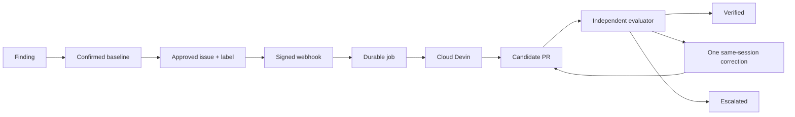

# Devin Remediation Platform

Turn a confirmed weak test into a candidate PR, then verify the repair independently of Devin.

An exception-only assertion can leave a test green when the expected exception disappears. This project detects suspicious tests, confirms the blind spot with a controlled regression, and launches one bounded Devin session from a signed GitHub issue-label event. A candidate is verified only when correct behavior passes and the **same active regression** is detected. It never merges remediation PRs.



## Run the simulation

Python 3.12+ and Make:

```bash
make demo
# Open http://localhost:8000
```

The first command creates `.venv` and installs the pinned dependencies. No credentials are needed. The simulation sends signed events through the real webhook and uses the real SQLite store and orchestrator with fake external adapters. It exercises first-pass verification, correction recovery, escalation, duplicate delivery suppression, and worker restart with an existing session. Every page identifies simulated data. `data/simulation.db` is rebuilt on each demo; `data/live.db` is untouched.

```bash
make test
make lint
.venv/bin/python -m app.demo --check  # bounded, non-server demo smoke test
```

Docker alternative, also simulation by default:

```bash
cp .env.example .env
docker compose up --build
```

Both services share `./data`. The worker exits successfully in simulation mode because the web startup runs the fake orchestration. `make down` stops the services without deleting data. Dashboard refresh is manual; there is no frontend build step.

## Evaluation

Two **runtime-confirmed baseline cases**, pinned to Superset `5ecb19cf92ae8dedbf5b33ec92324cc77c4ee10e`:

| Case | Contract | Pre-registered regression |
| --- | --- | --- |
| `histogram-invalid` | Invalid text raises `ValueError`; numeric strings remain valid | Suppress only the histogram's invalid-text rejection |
| `schema-no-engine` | Dynamic-form parameters without an engine raise `ValidationError` | Bypass only the missing-engine guard |

Source inspection found exception-only assertions in both files. The histogram fixture containing `"10"` is valid numeric input, not a reason to require an exception. The schema's invalid-engine fixtures also deserve investigation, but the registered challenge deliberately focuses on the narrower missing-engine behavior.

A source finding alone is **not** an accepted case. Both cases passed the original-test/active-regression baseline in [CI run 35408009780](https://github.com/dheeraj5612/devin-remediation-platform/actions/runs/35408009780). The unmodified reports are in `evals/evidence/`. Reproduce the proof and build your local evaluator image before live use:

```bash
make baseline
# Or: make baseline CASE=histogram-invalid
```

This builds the `superset-eval` Docker target from the pinned upstream checkout, then executes the original designated pytest tests in normal and mutant environments. Each run includes a behavioral positive control. Only PASS + PASS with active controls confirms a baseline. Reports are written to `data/baselines/` and bound to the baseline SHA and evaluator fingerprint. The live webhook and worker reject missing, stale, or unsuccessful proof. No Superset repair is included in this repository.

For a candidate, the normal run must pass and the mutant run must fail through an assertion or the expected missing-exception failure. Missing collection, import/setup errors, inactive mutations, skips, xfails, timeouts, and unrelated exceptions cannot verify a repair. A changed PR head invalidates the verdict.

The evaluator reconstructs a candidate from the immutable baseline and approved file contents at the exact PR SHA. It uses a temporary image and an unprivileged, network-disabled container with a read-only root, resource limits, and no API credentials or Docker socket. Candidate files cannot select executable commands. Local build/test diagnostics are retained in `data/last-evaluator.log`.

## Run live

Complete the baseline step **before enabling execution**. In `.env`, set:

```dotenv
MODE=LIVE
RUN_LIVE=true
DEVIN_API_KEY=your-service-user-key
DEVIN_ORG_ID=your-organization-id
DEVIN_MAX_ACU=5
GITHUB_REPOSITORY=your-account/superset
GITHUB_REPOSITORY_ID=your-forks-numeric-id
GITHUB_BASE_BRANCH=remediation-demo
GITHUB_TOKEN=your-github-read-token
GITHUB_WEBHOOK_SECRET=your-long-random-secret
CASE_ISSUES={"histogram-invalid":101,"schema-no-engine":102}
```

Replace the example issue numbers. The GitHub token only reads PRs/files; Cloud Devin needs its own connected fork write access. Keep `.env` local and untracked. Use a real numeric repository ID, not the platform repository's ID. `apache/superset` is explicitly blocked as a live target.

**Live preflight, in order:**

1. Create your Superset fork and a `remediation-demo` branch pointing to the exact registered baseline. Do not merge demonstration fixes into that branch.
2. Run `make baseline`. Both cases must be confirmed. `make doctor` reports local readiness without network calls or revealing secrets.
3. Generate issue text with `.venv/bin/python -m app.cli issue`. Create those issues manually in your fork and record their numbers in `CASE_ISSUES`. Do not add the trigger label yet.
4. Run `make bootstrap-context`. This creates or reuses one organization Playbook and Knowledge Note, saves their IDs to `data/context.json`, and launches no session. Review pre-existing same-name context objects before reuse.
5. Start `docker compose up --build`. Connect a GitHub **issues** webhook to `POST /webhooks/github` through your chosen HTTPS tunnel, with the same secret. Keep the unauthenticated dashboard private; expose only the webhook path or use tunnel access controls.
6. Add the exact label `devin-remediate` to **one** mapped issue. This is the paid trigger: the worker uploads evidence and launches Cloud Devin with `max_acu_limit`. Inspect its candidate and the external verdict before trying the second case.

Creating fork branches, issues, context objects, and webhooks has external side effects. Labeling an approved issue starts billable work. None of those remediation-side writes happen during `make demo`, tests, or baseline confirmation.

## Devin API usage

The adapter uses the [organization-scoped v3 API](https://docs.devin.ai/api-reference/overview), not legacy v1/v2:

| Primitive | Implemented endpoints |
| --- | --- |
| Sessions | `POST /sessions`, `GET /sessions`, `GET /sessions/{id}`, `POST /sessions/{id}/messages` |
| Playbook | `GET /playbooks`, `POST /playbooks` |
| Knowledge Note | `GET /knowledge/notes`, `POST /knowledge/notes` |
| Evidence attachment | Multipart `POST /attachments` |

Session creation passes `repos`, tags, attachment URLs, context IDs, `max_acu_limit`, and a structured-output schema. The [create-session reference](https://docs.devin.ai/api-reference/v3/sessions/post-organizations-sessions) and [context examples](https://docs.devin.ai/api-reference/common-flows) document these contracts. Provider `status` and `status_detail` are not internal job states. A finished session with no verifiable PR remains unverified.

Devin is useful here because an AST warning does not establish fixture semantics or intended behavior. The agent investigates those details and proposes a small repair; the deterministic harness decides whether the registered regression is now caught.

## Reliability and observability

The webhook checks the original-body HMAC, repository ID/name, event/action, label, and trusted issue mapping. SQLite uniqueness suppresses delivery and logical duplicates. A single worker holds an OS file lock; no network request holds a database transaction open.

Launch intent is persisted before the non-idempotent session request. A lost response is reconciled using a unique session tag. An unresolved outcome fails closed instead of launching again. Existing session IDs survive restarts. Transient provider errors have three bounded retries. A correction is sent at most once to the same session, waits for a new SHA, and escalates after another repair failure. An uncertain correction delivery requires manual reconciliation. Infrastructure errors are not sent as coding feedback.

The dashboard shows persisted outcomes, exact SHA, links, event history, and denominators. First-pass verification divides first-pass successes by jobs with an evaluation result, including infrastructure results. Correction recovery divides successful recoveries by completed correction attempts. Latencies use observed enqueue, PR-discovery, and verification timestamps. Simulation and live modes have separate database files and query filters.

## Results and limitations

**Initial targeted evaluation:** both pinned Superset cases are runtime-confirmed blind spots. The original tests passed against correct behavior and against their active controlled regressions; positive controls passed in all four runs. Checked-in reports in `evals/evidence/` come from the successful CI run linked above, not simulation. That run also passed Ruff, all 71 control-plane tests on Python 3.12, the deterministic simulation, and Docker build/start/health/dashboard checks.

No live Devin remediation has been executed, so there are **no live repaired-test results yet**. The next step is the explicit live preflight, not a claim that agent repairs already work. Baseline evidence must be reproduced locally before triggering paid work. The CI workflow publishes its raw evidence artifact on every run.

This is a single-worker take-home. It deliberately has no migrations, distributed leases, OAuth, deployment stack, automatic issue creation, or automatic merge. Logical executions are single-use per issue; an operator investigates failures rather than replaying a label to spend more credits. The worker has powerful local Docker-daemon access. Run it only on a trusted machine. Containers and scoped diffs reduce risk but do not solve prompt injection or adversarial evaluator tampering. Human review is still required; two targeted cases do not establish general repair reliability.

## Five-minute walkthrough

Start with the simulation's before/after results, open a job timeline, then explain why an active mutant failing is a success while an import error is not. Read these five entry points before presenting:

- `app/main.py:create_app`: signature verification and durable enqueue.
- `app/orchestrator.py:Orchestrator.tick`: launch intent, restart recovery, and bounded correction.
- `app/devin.py:Devin.create`: evidence, reusable context, session budget, and API payload.
- `app/validator.py:judge` and `Validator.run`: independent evaluation and container isolation.
- `evals/probe.py`: positive controls and the two pre-registered challenges.
