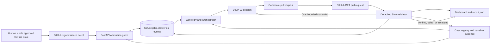

# App walkthrough: from an approved label to an independent proof

This document explains the whole application in two passes. The first pass is the
ELI5 story. The second pass names the files, routes, fields, state transitions,
and external calls that implement it. The application is an orchestration and
evidence control plane. Devin investigates and edits a candidate branch; the
control plane decides whether the candidate is independently verified.

## The ELI5 version

An operator first writes down a small repair case: which repository, issue, source
commit, files, behavior contract, and acceptance check are allowed. A local
baseline run proves that the pinned source really has the selected weakness. The
operator binds one GitHub issue to that case. Adding the exact `devin-remediate`
label to that issue is the human approval signal.

GitHub sends a signed issue event. The web process checks the signature, repository,
label, issue binding, and current evidence. It stores one durable job in SQLite.
The web process does not call Devin. A separate worker reads the job, starts one
bounded Devin session, and polls it. When Devin reports a pull request, the worker
asks GitHub for the pull request itself and pins the exact head commit.

The validator checks that commit in a detached worktree. For a test-quality case,
it runs the registered test once normally and once with the registered controlled
regression. For an application case, it runs a trusted source-backed oracle with a
valid-input control and the malformed-input contract. A good Devin summary or an
open pull request is not proof. Only the independent validator can move a job to
`VERIFIED`.

Every meaningful decision is an SQLite event. If a request times out, the durable
intent tells the next worker whether it is safe to recover or whether a human must
reconcile it. A genuine repair failure gets one correction message in the same
Devin session. A changed pull-request head, ambiguous launch, missing proof, or
infrastructure failure stops safely and appears on the dashboard.

## Architecture



The web process and worker communicate through the database, not through an
in-process queue. The `/dashboard` workbench reads the same normalized report as
`/report.json`. There is no auto-merge path, GitHub issue-creation client, webhook
configuration client, tunnel client, or normal-worker provider-termination
method.

## Repository map

| Area | Source of truth | Purpose |
| --- | --- | --- |
| HTTP admission | [`app/main.py`](../app/main.py) | HMAC verification, health, metrics, report export, webhook admission, and security headers |
| Presentation routes | [`app/views.py`](../app/views.py), [`app/presentation.py`](../app/presentation.py) | Read-only landing, workbench, contracts, archive, and job-detail views |
| Configuration | [`app/config.py`](../app/config.py) | Typed environment settings and live safety gates |
| Case policy | [`app/cases.py`](../app/cases.py), [`evals/cases.yaml`](../evals/cases.yaml) | Immutable scope, issue binding, case and harness fingerprints, baseline proof |
| Durable state | [`app/models.py`](../app/models.py), [`app/db.py`](../app/db.py) | Jobs, deliveries, append-only events, SQLite transactions, and legal transitions |
| Worker policy | [`worker.py`](../worker.py), [`app/orchestrator.py`](../app/orchestrator.py) | Resume, launch, poll, exact-head validation, correction, retry, and escalation |
| External adapters | [`app/devin.py`](../app/devin.py), [`app/github.py`](../app/github.py) | Locked-down Devin v3 and GitHub REST reads |
| Independent validation | [`app/validator.py`](../app/validator.py), [`evals/challenges.py`](../evals/challenges.py) | Scope, provenance, subprocess, normal/mutant, and application-oracle checks |
| Application oracle | [`evals/application_cases/import_unparseable_yaml.py`](../evals/application_cases/import_unparseable_yaml.py) | Trusted valid-control and malformed-YAML contract |
| Report and metrics | [`app/report.py`](../app/report.py), [`app/metrics.py`](../app/metrics.py) | Read-only JSON model, readiness, workflow funnel, counters, and denominators |
| Safe demo | [`app/simulation.py`](../app/simulation.py), [`app/cli.py`](../app/cli.py) | Six-job credential-free run using fake external adapters |
| Browser view | [`app/templates`](../app/templates), [`app/static`](../app/static) | Server-rendered DevinTrace pages and local assets |

## Modes, storage, and startup

`Settings` defaults to `MODE=LIVE`, but live execution is disabled unless the
operator also sets `ENABLE_LIVE=true` and satisfies every other safety gate. The
two modes use separate storage directories: `DATA_DIR/live` and
`DATA_DIR/simulation`. The SQLite file is `jobs.sqlite` inside the selected mode
directory. Credentials are held as masked settings and are never printed by the
doctor or report.

| Variable | Default | Meaning |
| --- | --- | --- |
| `MODE` | `LIVE` | `LIVE` uses real adapters; `SIMULATION` uses fakes and fixed demo issues |
| `DATA_DIR` | `data` | Root for mode-isolated SQLite and evidence |
| `ENABLE_LIVE` | `false` | Explicit paid-execution switch |
| `GITHUB_REPOSITORY` | empty | Dedicated `owner/name` fork accepted by the webhook and PR reader |
| `GITHUB_REPOSITORY_ID` | `0` | Numeric GitHub repository identity checked beside the name |
| `GITHUB_TOKEN` | empty | Bearer token used only by the GitHub PR reader |
| `GITHUB_WEBHOOK_SECRET` | empty | HMAC secret for the incoming webhook |
| `BASE_BRANCH` | `remediation-demo` | Default Devin PR base branch; a case may override it |
| `CASE_ISSUES` | `{}` | JSON map from case ID to approved positive issue number |
| `CASES_FILE` | `evals/cases.yaml` | YAML allow-list of case contracts and scopes |
| `DEVIN_API_KEY` / `DEVIN_ORG_ID` | empty | Devin credentials and organization identity |
| `DEVIN_MAX_ACU` | `3` | Per-session provider cap, validated between 1 and 20 |
| `POLL_SECONDS` | `5` | Worker polling interval, greater than 0 and at most 60 seconds |
| `JOB_TIMEOUT_SECONDS` | `3600` | Wall-clock deadline before escalation |
| `SUPERSET_REPO_PATH` | `.superset` | Disposable checkout used by the validator |
| `SUPERSET_PYTHON` | `.superset/.venv/bin/python` | Interpreter with the pinned application dependencies |
| `SUPERSET_CONFIG_PATH` | empty | Optional dedicated Superset configuration path |
| `ALLOW_LOCAL_VALIDATION` | `false` | Required acknowledgement that candidate code runs locally |
| `VALIDATION_TIMEOUT_SECONDS` | `180` | Per-oracle or phase timeout |

Safe local setup and the credential-free demo are:

```bash
python3 -m venv .venv
. .venv/bin/activate
pip install -c constraints.txt -e '.[dev]'
make demo
```

`make demo` resets only simulation storage, posts signed events to the real
FastAPI application, and substitutes fake Devin, GitHub, and validator adapters.
It can serve the local page at `http://127.0.0.1:8000`. `make test` and `make
lint` exercise the control plane. `make baseline` is a local proof command and
writes mode-specific baseline evidence. `make bootstrap-context` is an operator
command that may call Devin to create or reuse context resources, so it is not a
simulation command. `make doctor` performs read-only configuration checks.

For a configured live pilot, the worker entry point is `python worker.py`. The
Docker web service is started by `make up`; the worker is behind the Compose
`live` profile and would be started explicitly with `docker compose --profile
live up --build`. The worker refuses non-`LIVE` mode, missing live settings,
missing baseline proof, a second worker lock, or a missing disposable evaluator.

To start only the read-only web surface in live mode, with no paid call admitted,
use the explicit disabled switch below. Do not treat a healthy page as pilot
readiness:

```bash
MODE=LIVE ENABLE_LIVE=false ALLOW_LOCAL_VALIDATION=false uvicorn app.main:create_app --factory --host 127.0.0.1 --port 8000
```

## HTTP surface

FastAPI also exposes its default `/openapi.json`, `/docs`, and `/redoc` routes
because `create_app` does not disable them. The OpenAPI JSON is the reliable
machine-readable schema. The browser docs UI is not a product surface and its
external asset behavior is constrained by the app's Content Security Policy.

The product has read-only HTML views plus JSON and webhook endpoints. The HTML
routes are installed by `app/views.py`; `/static/` serves local assets.

| Method and path | Success response | Behavior |
| --- | --- | --- |
| `GET /` | HTML landing page | Explains the workflow and shows the separately archived live application record |
| `GET /dashboard` | HTML workbench | Reads one report snapshot; supports `q`, `view`, `kind`, `sort`, and `page` query parameters |
| `GET /cases` | HTML contracts page | Shows registered scope, acceptance, baseline state, and pilot-readiness gates |
| `GET /evidence` | HTML archive page | Shows the checked-in dated live application record outside workspace metrics |
| `GET /jobs/{job_id}` | HTML detail or JSON/HTML 404 | Shows one normalized job, verdict, safe links, and event timeline |
| `GET /healthz` | `{"status":"ok","mode":"LIVE\|SIMULATION","live_enabled":false}` | Reads the selected database and reports mode and switch; it does not launch work |
| `GET /metrics` | JSON counters from [`app/metrics.py`](../app/metrics.py) | Read-only counters, not a Prometheus exposition endpoint |
| `GET /report.json` | `devin-remediation-evidence-{mode}.json` attachment | Exports the same report model shown in HTML |
| `POST /webhooks/github` | HTTP 202 with `{"job_id", "status", "duplicate"}` | Admits one approved issue label into durable storage |
| `GET /robots.txt` | Plain text | Keeps operational pages out of indexes; it is not access control |

Every response receives `X-Content-Type-Options: nosniff`,
`Referrer-Policy: no-referrer`, and a restrictive Content Security Policy.
Operational responses also receive `X-Robots-Tag: noindex, nofollow` and
`Cache-Control: no-store`; the dashboard has no authentication, so it must stay
on a protected operator network.

### Signed event shape and admission order

The following is an illustrative payload. The repository ID, repository name,
issue number, delivery ID, and signature are placeholders and must be replaced by
the configured values. GitHub signs the exact raw UTF-8 bytes, including
whitespace, with the shared secret.

```http
POST /webhooks/github
Content-Type: application/json
X-GitHub-Event: issues
X-GitHub-Delivery: DELIVERY-ID-123
X-Hub-Signature-256: sha256=<HMAC_SHA256_HEX>

{"action":"labeled","repository":{"id":123456,"full_name":"owner/dedicated-fork"},"issue":{"number":123},"label":{"name":"devin-remediate"}}
```

`read_signed_body` streams at most 256 KiB, computes HMAC-SHA256, and compares it
in constant time before JSON parsing. The webhook then applies these gates in
order:

1. A webhook secret must be configured. `ping` returns `{"status":"pong"}` and
   other event families return `{"status":"ignored"}` after signature checks.
2. The JSON must be an object with strict numeric repository and issue IDs, a
   positive issue number, action `labeled`, and the exact label
   `devin-remediate`.
3. Both repository `id` and `full_name` must match settings. The issue number must
   resolve through the immutable registry and configured case binding.
4. `X-GitHub-Delivery` must match `[A-Za-z0-9-]{1,200}`. In `LIVE`, settings,
   disposable interpreter, case branch context, and current baseline evidence are
   checked before enqueueing.
5. `Store.enqueue` uses a transaction. The response is HTTP 202 only after the
   durable row and its first event exist. Invalid signatures are 401, oversized
   bodies are 413, malformed payloads are 400 or 422, repository mismatches are
   403, and missing live setup is 503.

The same delivery ID is recorded as `DUPLICATE_DELIVERY`. A different delivery
for the same mode, repository, issue, and generation is recorded as
`DUPLICATE_EXECUTION`. Both return the existing job and prevent a second paid
session.


## Cases, scope, and evidence

The YAML registry currently contains two test-quality cases and one application
case. The application case has its own source baseline and target branch.

| Case | Kind | Baseline and target | Allowed candidate path | Independent acceptance |
| --- | --- | --- | --- | --- |
| `histogram-invalid-column` | `test_quality` | `5ecb19cf92ae8dedbf5b33ec92324cc77c4ee10e`, default branch | `tests/unit_tests/pandas_postprocessing/test_histogram.py` | Normal test passes; the active invalid-input regression is caught |
| `schema-missing-engine` | `test_quality` | `5ecb19cf92ae8dedbf5b33ec92324cc77c4ee10e`, default branch | `tests/unit_tests/databases/schema_tests.py` | Normal test passes; the missing-engine regression is caught |
| `import-unparseable-yaml` | `application` | `dedfe23a805151decca6deaf15b032e040e42e82`, `remediation-import-yaml` | `superset/commands/importers/v1/utils.py` | Valid mapping loads; malformed YAML yields one file-scoped validation error |

The case model is frozen and rejects extra fields. Application oracle paths must
be relative Python files under `evals/application_cases/`. `Registry.evidence`
requires `CONFIRMED`, `LIVE`, the exact case ID and baseline SHA, the current case
fingerprint, and the current harness fingerprint. Test-quality proof requires
normalized `normal=PASS` and `mutant=PASS`. Application proof requires exact
baseline `application=REGRESSION` and `provenance=true`.

The harness fingerprint includes the repository-relative path names and raw source
bytes of `app/cases.py`, `evals/challenges.py`, `app/validator.py`, and every
application oracle. A comment or docstring change in one of those files therefore
invalidates old baseline proof for a new launch, even when Python behavior is
unchanged. The recorded live proof remains a valid historical result for the
harness fingerprint captured at that time; a future live launch needs a fresh
baseline after any evaluator or harness change, including comment-only changes.
The validator separately requires
a candidate descendant of the pinned baseline, non-empty diff, only registered
paths, regular `100644` files, at most 200 changed lines, and a 40-character
lowercase head SHA. The worker re-reads GitHub immediately before accepting a
verified result, so a later PR push cannot borrow an earlier verdict.

Test-quality validation runs in a fresh detached worktree with the external
challenge plugin. The normal phase must pass. The mutant phase must fail through
the expected assertion after the registered control is active; the normalized
evidence then records `mutant=PASS`. Skips, xfails, incomplete phase reports,
non-assertion exceptions, inactive controls, timeouts, and imports from outside
the detached checkout are not proof.

The application oracle imports the candidate production module from the detached
checkout only after creating a disposable Superset app context. It uses a fake
empty database query and recording schema to avoid hidden database state. It first
loads `datasets/valid.yaml` and requires one mapping and one schema call. It then
passes an unterminated `databases/malformed.yaml`. The pinned baseline's
`UnboundLocalError` containing `config` is the exact `REGRESSION`; the fixed
contract returns `PASS` only when there is no partial config, no schema load, and
exactly one `marshmallow.ValidationError` whose messages equal
`{"databases/malformed.yaml": "Not a valid YAML file"}`. A wrong valid control or
a wrong malformed result is `CONTRACT_FAILED`, which the candidate cannot count
as a pass.

The Devin attachment contains the frozen case and baseline proof but excludes the
human `inspection` field, so the agent receives the contract and broken-baseline
evidence without receiving the known reference fix recipe.

## Exact outbound API calls

### Devin v3

The client base URL is
`https://api.devin.ai/v3/organizations/{DEVIN_ORG_ID}/`. It sends
`Authorization: Bearer <DEVIN_API_KEY>`, uses a 30-second timeout, does not follow
redirects, and ignores ambient proxy environment variables. The common request
wrapper makes one HTTP request, parses JSON only on success, omits response bodies
from errors, and marks network errors, 429, and 5xx as retryable. `Retry-After` is
bounded to 1 through 60 seconds, with a five-second fallback. The orchestrator
allows at most three retryable failures before `FAILED` or reconciliation.

| Method | Relative path | Request and trusted response fields |
| --- | --- | --- |
| `GET` | `playbooks` | Cursor pages with `first=100`, then `after`; response `{items, has_next_page, end_cursor}` |
| `POST` | `playbooks` | `{title, body}`; response must contain string `playbook_id` |
| `GET` | `knowledge/notes` | Same bounded cursor pagination |
| `POST` | `knowledge/notes` | `{name, body, trigger, is_enabled:true}`; response must contain string `note_id` |
| `POST` | `attachments` | Multipart `file=(case-id.json, JSON artifact, application/json)`; response must contain string `url` |
| `POST` | `sessions` | `{prompt,title,repos,playbook_id,knowledge_ids,attachment_urls,tags,max_acu_limit,structured_output_schema,structured_output_required:true}`; response is validated as `SessionState` |
| `GET` | `sessions` | Cursor pages; worker searches `tags` for `drp-{job_id}` during uncertain launch recovery |
| `GET` | `sessions/{session_id}` | Response fields used are `session_id,status,url,status_detail,pull_requests,tags` |
| `POST` | `sessions/{session_id}/messages` | Exactly one correction body: `{"message":"..."}` |

The session creation body has this shape. Every angle-bracket value is an
operator or provider value, not a repository secret embedded in the code:

```json
{
  "prompt": "<case contract and bounded repair instructions>",
  "title": "<case title>",
  "repos": ["<owner/name>"],
  "playbook_id": "<playbook-id>",
  "knowledge_ids": ["<knowledge-note-id>"],
  "attachment_urls": ["<attachment-url>"],
  "tags": ["drp-<job-id>", "<case-id>"],
  "max_acu_limit": 3,
  "structured_output_schema": {
    "type": "object",
    "properties": {"pr_url": {"type": "string"}, "summary": {"type": "string"}},
    "required": ["pr_url", "summary"],
    "additionalProperties": false
  },
  "structured_output_required": true
}
```

The adapter accepts a session response only after validating fields such as
`session_id`, `status`, an optional `https://app.devin.ai` URL,
`status_detail`, `pull_requests`, and `tags`. A session list or detail record may
look like this:

```json
{
  "session_id": "<provider-session-id>",
  "status": "running",
  "url": "https://app.devin.ai/<session-path>",
  "status_detail": "working",
  "pull_requests": [{"pr_url": "https://github.com/<owner>/<name>/pull/123"}],
  "tags": ["drp-<job-id>", "<case-id>"]
}
```

The structured output is requested for the agent summary, while GitHub discovery
uses the session's `pull_requests[].pr_url` as a hint and then verifies the PR
with `GET pulls/{number}`. The summary itself never proves a repair.

Context bootstrap uses content-addressed, repository-scoped v2 names in the form
`superset-remediation-<repo-slug>-<repo-hash10>-<body-hash10>-v2`. Same repository
and same body reuse the same resource; the raw repository hash prevents punctuation
variants from colliding, while duplicate names or a same-named resource with
different body stop for manual reconciliation. The context file records
organization, repository, default and per-case base branches, playbook ID, and
knowledge note ID. `launch_preflight` checks the local checkout and executable
interpreter before any attachment or session request, then checks that context
identity and the case branch match.

### GitHub REST

The GitHub client base URL is
`https://api.github.com/repos/{GITHUB_REPOSITORY}/`. It sends
`Authorization: Bearer <GITHUB_TOKEN>`, `Accept: application/vnd.github+json`,
and `X-GitHub-Api-Version: 2022-11-28`.

The only normal outbound GitHub call is `GET pulls/{number}`. A PR is accepted
only when it is open, not draft, not merged, based on the case-specific target
branch, and both base and head repository IDs equal the configured fork. Its
lowercase 40-character `head.sha` becomes the immutable validator input. Devin's
reported PR URL is only a hint; the adapter accepts only an exact URL for the
configured repository and refuses multiple candidates. There are no GitHub API
methods here for creating issues, applying labels, opening branches, merging PRs,
or configuring webhooks.

## Durable state, recovery, and correction

SQLite uses WAL mode, foreign keys, a ten-second busy timeout, and a mode filter
on every query. The tables are:

| Table | Important columns | Role |
| --- | --- | --- |
| `jobs` | `id`, `mode`, `case_id`, delivery, repository, issue, generation, status, Devin identity, candidate and validated SHA, correction flags, retry counters, validation JSON, timestamps | One durable remediation attempt |
| `events` | `id`, `job_id`, `event_type`, timestamp, redacted JSON details | Append-only job diary and metric source |
| `deliveries` | delivery ID, mode, job ID, received time, duplicate count | Webhook idempotency ledger |

The database uniqueness rule is `(mode, repository, issue_number, generation)`.
`Store.change` validates every status transition and writes the status, ordinary
field updates, and event in one transaction. `Store.defer` writes the next poll
time for backoff.

The normal path is:

```mermaid
stateDiagram-v2
    [*] --> QUEUED
    QUEUED --> DEVIN_RUNNING: start deadline; launch on next tick
    DEVIN_RUNNING --> PR_OPENED: one valid candidate observed
    DEVIN_RUNNING --> ESCALATED: ambiguous or no candidate
    PR_OPENED --> VALIDATING
    VALIDATING --> VERIFIED: exact SHA passes
    VALIDATING --> CORRECTING: repair failure and count is zero
    VALIDATING --> PR_OPENED: candidate head changed
    VALIDATING --> FAILED: infrastructure failure
    VALIDATING --> ESCALATED: unresolved contract or unstable head
    CORRECTING --> PR_OPENED: same session reports new commit
    CORRECTING --> ESCALATED: correction delivery uncertain
    CORRECTING --> ESCALATED: provider ends without a candidate
```



Before `POST /sessions`, the worker records `LAUNCH_REQUESTED` and sets
`launch_requested`. If the response is lost, it searches `GET sessions` by the
job tag. One match is attached; zero matches becomes
`RECONCILIATION_REQUIRED`; multiple matches become a manual stop. It never
blindly creates a second session. On restart, `resume()` records `WORKER_RESUMED`
for unfinished jobs with a saved session and continues from durable state.

After a candidate validation failure, `CORRECTING` is allowed once. The worker
records `CORRECTION_REQUESTED` before the message, sends it to the same session,
then records `CORRECTION_SENT`. If the process crashes after the request marker,
the worker escalates instead of sending a duplicate correction. A changed PR head
is re-read and revalidated at most three times. A job deadline becomes
`ESCALATED` with an instruction to inspect or terminate the existing provider
session. The normal worker does not terminate it automatically.

## Dashboard, report, metrics, and readiness

`build_report` reads one job snapshot and one event snapshot, then returns report
schema `devin-remediation-evidence/v1` with:

```text
truth       mode, simulation boolean, and a statement of what the snapshot proves
metrics     counters and their denominators
readiness   simulation boundary or seven live configuration checks
workflow    approved findings, sessions, candidate PRs, oracle evaluations, verified jobs
cases       contract, scope, target branch, baseline, proof, and latest job
jobs        normalized status, safe URLs, candidate/validated SHAs, validation, events
```

The seven live readiness rows are execution switch, dedicated repository,
disposable validator, Superset interpreter, Devin context, case bindings, and
baseline evidence. Readiness calls no provider API. In live mode, context readiness
uses the same `launch_preflight` check used before enqueue and launch, including
case branch, organization, and repository identity. Simulation explicitly reports
`SIMULATION` and `NOT_EVALUATED` for live gates.

`/metrics` is JSON, not Prometheus. Its denominators are deliberate:

| Metric | Definition |
| --- | --- |
| `jobs_total`, `attempted`, `active`, `verified`, `unsuccessful` | Durable job status totals |
| `first_pass` / `first_pass_denominator` | Verified jobs with zero corrections / evaluated first attempts with an assessed outcome |
| `correction_recovery` / `correction_denominator` | Verified jobs after `CORRECTION_SENT` / jobs that received that event |
| `median_event_to_pr_seconds` | Median job creation to persisted PR timestamp |
| `median_event_to_verified_seconds` | Median job creation to verified completion |
| `duplicate_deliveries`, `duplicate_executions` | Suppressed duplicate event counts |
| `status_counts`, `validation_counts` | Full durable status and validation distributions, including `NOT_RUN` |

The report allow-lists event details and secure URLs. It does not invent merge
state, customer impact, return on investment, or cost from an ACU cap.

The workbench places four KPI cards above the five-step handoff line and a
paginated job ledger. The cards show persisted runs, runs needing attention,
first-pass verified jobs over the assessed first-attempt denominator, and
correction recovery over the correction-sent denominator. The handoff line counts
approved findings, Devin sessions, candidate PRs, oracle evaluations, and
independently verified jobs. These are server-rendered counts, not conversion
claims or client-side telemetry.


## Simulation versus LIVE

The credential-free simulation seeds six signed jobs using real admission,
database, orchestrator, report, and template code. Fake adapters create the
following scenarios: first-pass test verification, correction recovery,
escalation, worker restart, application acceptance, and application rejection.
The deterministic run is expected to produce six jobs, four `VERIFIED`, two
`ESCALATED`, six fake sessions, and three correction messages. These counts
demonstrate control-flow behavior and are not live remediation rates.

LIVE uses the real GitHub and Devin adapters and a disposable local validator.
The worker will not start until `live_errors()` is empty, every configured case
has current proof, the interpreter and checkout exist, context identity matches,
and the single-worker lock is acquired. The dashboard can display live records,
but it does not make a provider result trustworthy by itself.

## Historical live application walkthrough

The tracked evidence is intentionally split into source comparison and live
execution:

1. [`evidence/application-oracle.json`](../evidence/application-oracle.json)
   records the pinned application baseline as `REGRESSION` and the source-backed
   known reference as `PASS`. It explicitly says the reference result was not a
   new Devin run and that no provider call occurred.
2. [`evidence/live-application.json`](../evidence/live-application.json) records
   one Devin application run. The durable job reached `VERIFIED`, the trusted
   application oracle returned `PASS`, provenance was true, and correction count
   was zero.
3. The observed candidate was
   [dheeraj5612/superset PR #8](https://github.com/dheeraj5612/superset/pull/8),
   based on `remediation-import-yaml`, with the candidate and validated SHA
   recorded in the evidence file. The archived capture says the PR was open and
   unmerged at capture time. The pilot used manual orchestration ticks and stopped
   before candidate execution; the standard worker has no such human-approval
   checkpoint.
4. The archived provider snapshot records a successful termination request and a
   provider-reported 0.0 ACU value. It is marked `cost_claim=false`, so it is not
   an independent cost result.

The current dashboard remains a read-only live evidence view. Fresh baseline proof
is required before re-enabling any future live launch after evaluator or harness
fingerprints change. A human must inspect the candidate diff, decide whether to
merge it, and handle any provider cleanup or termination.

## Manual pilot versus application API

The application API covers signed admission, durable orchestration, provider
session creation and polling, PR read-back, independent validation, and report
export. A normal pilot operator still performs these steps outside the code:

1. Create or configure the dedicated fork, issue, GitHub webhook delivery URL,
   `issues` event subscription, shared secret, and approved label.
2. Prepare the pinned checkout and interpreter, run `make baseline`, run
   `make bootstrap-context` when remote context is needed, then run `make doctor`.
3. Start the web process and `python worker.py`; watch `/dashboard`,
   `/jobs/{job_id}`, and `/report.json`. Use `/` for the product overview and
   `/cases` for contract and readiness details.
4. Inspect the exact candidate SHA and complete diff in GitHub after the platform
   reports `VERIFIED`. Human review and merge remain separate decisions.
5. If a job escalates for a deadline or uncertain provider action, inspect the
   same Devin session and use the provider's own console or documented operator
   API to reconcile or terminate it. Tunnel setup and webhook delivery are also
   operator infrastructure, not methods in this repository.

This separation is intentional. The app can prove what it observed and can stop
when it cannot prove identity, but it cannot safely infer that a provider session
is disposable or that a PR should be merged.

## Common debugging checks and limits

* `GET /healthz` checks that the selected SQLite store is readable and shows the
  mode. It does not prove live readiness.
* `make doctor` prints setting names and safe failure reasons. It never prints
  credential values. A missing interpreter, context mismatch, missing issue
  binding, or stale fingerprinted proof blocks the pilot.
* A `DUPLICATE_DELIVERY` event means GitHub retried the same delivery. A
  `DUPLICATE_EXECUTION` event means a second delivery pointed at the same issue.
  Neither starts another job.
* `FAILED` means control-plane or infrastructure failure. `ESCALATED` means a
  human must resolve an ambiguous provider action, unresolved repair, unstable
  head, deadline, or missing candidate. Neither is a verified repair.
* The dashboard has no authentication, SQLite is designed for one worker,
  candidate Python runs locally without a hostile-code sandbox, and the registry
  covers two selected test-quality nodes plus one application oracle rather than
  the full Superset suite. These are review and deployment limits, not hidden
  success claims.

For a short presentation, pair this reference with
[`docs/demo-script.md`](demo-script.md). For implementation details, follow the
source links above, beginning with [`app/main.py`](../app/main.py),
[`app/orchestrator.py`](../app/orchestrator.py), and
[`app/validator.py`](../app/validator.py).
